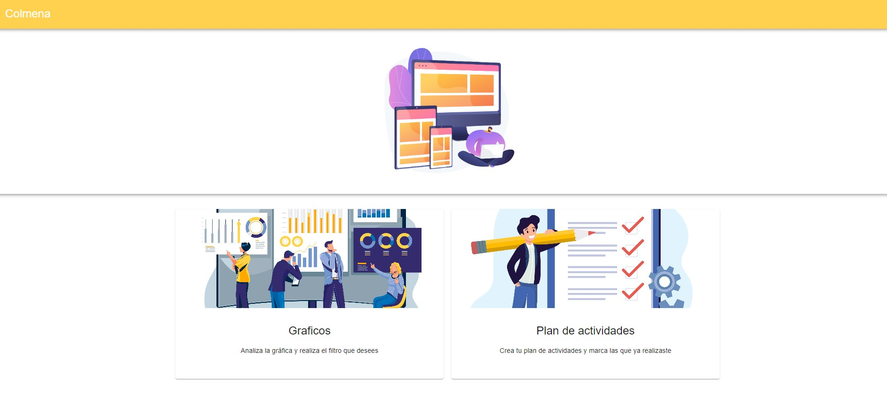
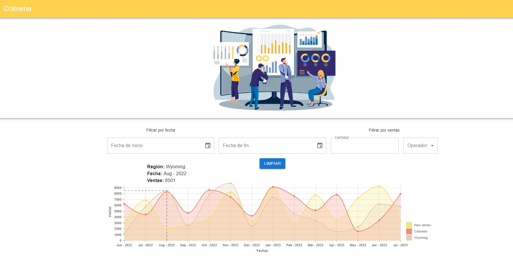
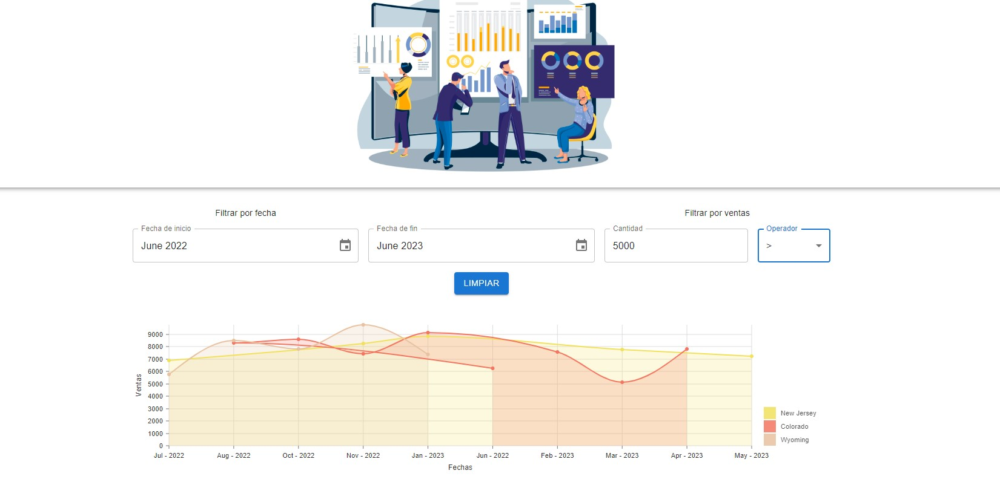
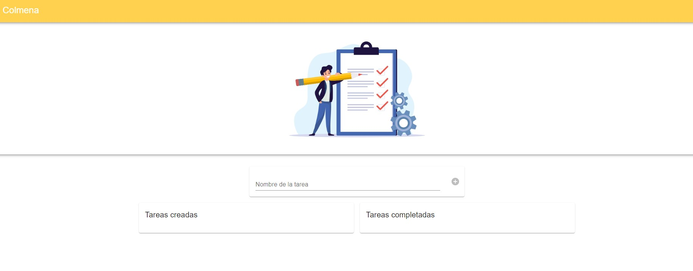
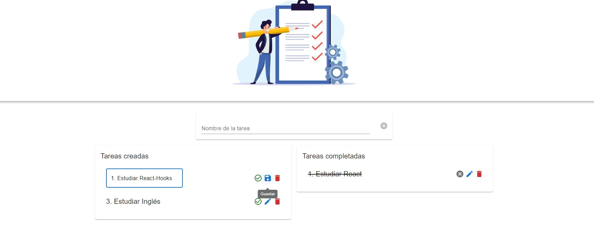

# Getting Started with Vite React

This project is build with React, Vite, Material UI, and TypeScript.

## Demo

## Available Scripts

In the project directory, you can run:

`npm run dev`

## Environment Variables

You can create a `.env` file in the root directory to set environment variables.

## Run test

The test is build with vitest

`npm test`
